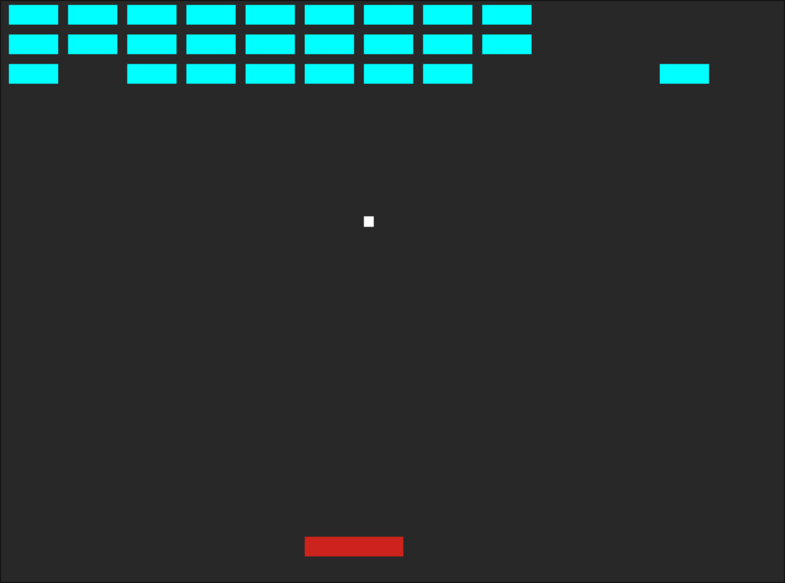

# Brick Breaker Zig

[Brick Breaker](https://en.wikipedia.org/wiki/Brick_Breaker) in Zig.

## Getting Started

### Prerequitites

- [Zig](https://ziglang.org/download/) (master)

### Building

```shell
zig build
```

### Running

```shell
zig build run
```


